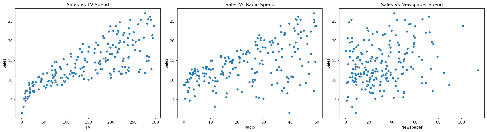
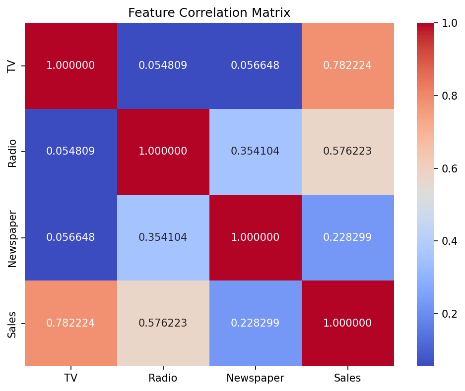
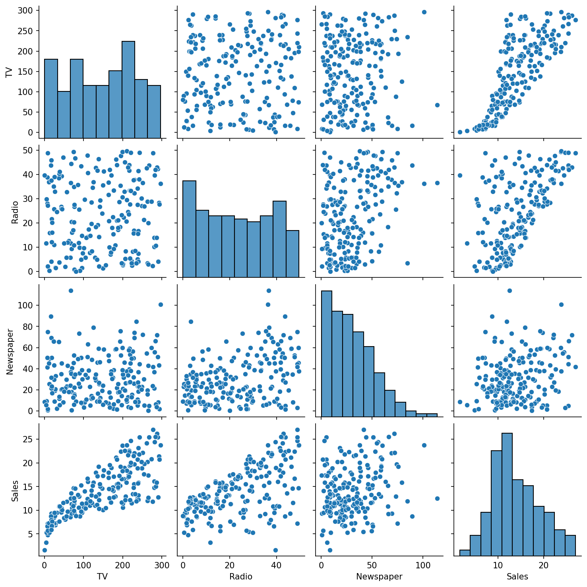
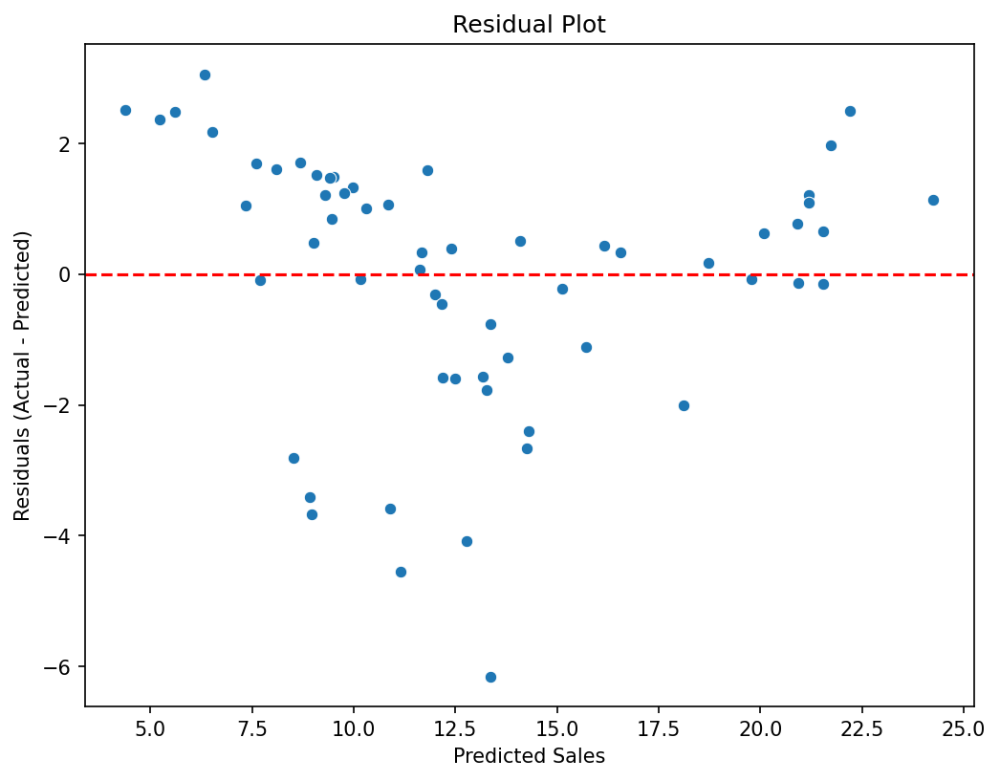

# Sales Prediction Using Python

## Objective
Build a regression model that predicts product sales based on advertising spend across three media channels: TV, Radio, and Newspaper.

## Tech Stack
Python, pandas, scikit-learn, matplotlib, seaborn, Streamlit, Jupyter Notebook

## Dataset
The "Advertising" dataset — 200 records showing advertising budget (in thousands of dollars) across TV, Radio, and Newspaper, along with resulting Sales (in thousands of units).

## Approach
- Performed data cleaning (removed redundant index column)
- Conducted EDA using scatter plots, pairplot, and a correlation heatmap
- Split data into training (70%) and testing (30%) sets
- Trained a Linear Regression model
- Evaluated performance using MAE, MSE, RMSE, and R² score
- Analyzed residuals to confirm no major systematic bias
- Built an interactive Streamlit web app for real-time sales prediction

## Key Insights
- **TV** advertising shows the strongest correlation with Sales (0.78), followed by **Radio** (0.58), and **Newspaper** (0.23)
- TV and Radio spending are independent of each other (low correlation between features), which supports a reliable regression model
- The model achieved strong, consistent performance on both training and test data, indicating no significant overfitting

## Results
| Metric | Training | Testing |
|--------|----------|---------|
| MAE | 1.16 | 1.51 |
| RMSE | 1.57 | 1.95 |
| R² Score | 0.91 | 0.86 |

## Visualizations

### Scatter Plots — Sales vs Each Advertising Channel


### Feature Correlation Heatmap


### Pairplot


### Residual Plot


## Live Demo
🔗 [Try the app here]()

## How to Run
```bash
pip install -r requirements.txt
streamlit run app.py
```