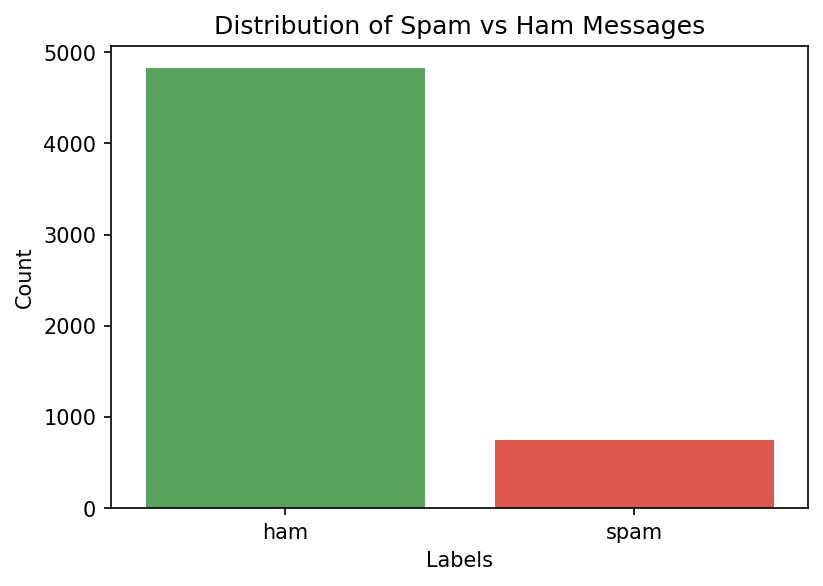
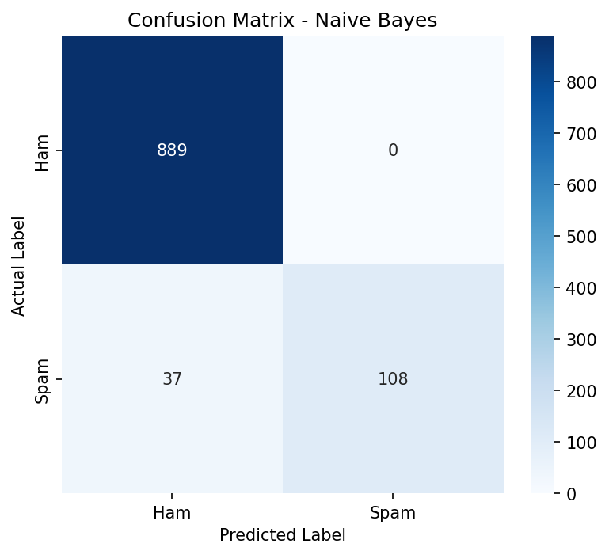
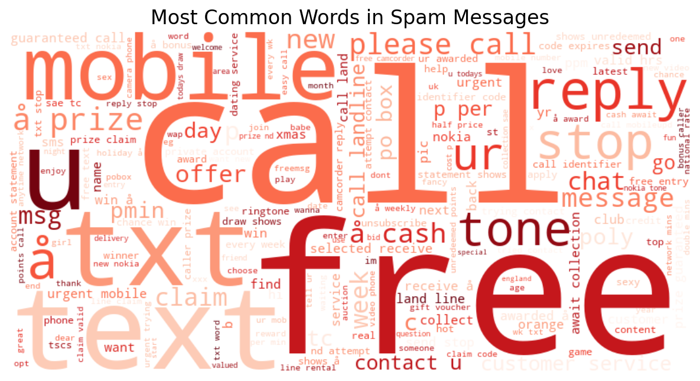
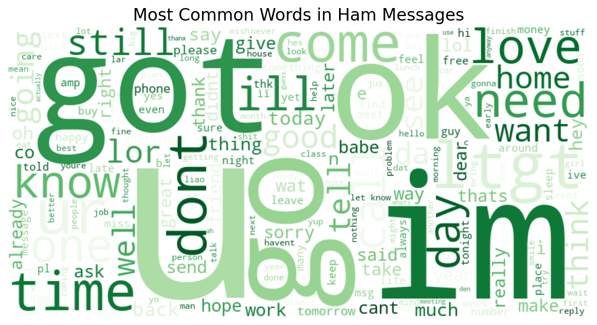

# Email/SMS Spam Detection with Machine Learning

## Objective
Build a Natural Language Processing (NLP) binary classifier that distinguishes spam messages from legitimate (ham) messages.

## Tech Stack
Python, pandas, scikit-learn (TF-IDF, Naive Bayes, Logistic Regression), NLTK, WordCloud, Streamlit, Jupyter Notebook

## Dataset
The SMS Spam Collection dataset — 5,572 SMS messages labeled as either "ham" (legitimate) or "spam". After removing duplicates, 5,169 unique messages remained.

## Approach
- Cleaned and renamed dataset columns, removed duplicate entries
- Analyzed class distribution (86.6% Ham, 13.4% Spam — notably imbalanced)
- Built a text preprocessing pipeline: lowercasing, number removal, punctuation removal, and stopword removal
- Converted cleaned text into numerical features using TF-IDF Vectorization
- Trained and compared two classifiers: Multinomial Naive Bayes and Logistic Regression
- Evaluated both models using Accuracy, Precision, Recall, and F1-Score
- Visualized the most frequent words in spam vs. ham messages using WordClouds
- Built an interactive Streamlit app for real-time message classification

## Why Recall Matters for Spam Detection
Recall measures how many actual spam messages the model successfully catches. If we only optimized for Accuracy, a model could score ~86% simply by labeling everything as "Ham" (since that's the majority class) — while being completely useless at catching spam. However, Precision also matters: a false positive (a legitimate message marked as spam) risks the user missing an important message entirely. Our model prioritizes high Precision (100%) over higher Recall, meaning it never misclassifies a real message as spam, though it misses some actual spam (Recall of 74.5%). This is a safer tradeoff for real-world use.

## Results

| Metric | Naive Bayes | Logistic Regression |
|--------|-------------|----------------------|
| Accuracy | 96.4% | 95.5% |
| Precision | 100% | 93.75% |
| Recall | 74.5% | 72.4% |
| F1-Score | 85.4% | 81.7% |

**Best Model:** Naive Bayes — selected for its higher accuracy, perfect precision, and better F1-score, and because it's the industry-standard approach for text classification tasks.

## Visualizations

### Class Distribution


### Confusion Matrix (Naive Bayes)


### Most Common Words in Spam Messages


### Most Common Words in Ham Messages


## Real-World Testing & Limitations
During manual testing with real Gmail marketing/promotional emails, the model frequently misclassified them as "Ham" with high confidence. This is because the model was trained exclusively on SMS-style spam (short messages using words like "free", "call", "urgent", "prize"), while modern email spam and marketing content uses different vocabulary (e.g., "unsubscribe", "dashboard", business terminology). 

**Conclusion:** This model performs well on SMS-style spam but would require retraining on an email-specific dataset (such as Enron-Spam or SpamAssassin) to generalize effectively to real email inboxes like Gmail.

## Live Demo
🔗 [Try the app here](aapka-streamlit-link-yahan-daalein)

## How to Run
```bash
pip install -r requirements.txt
streamlit run app.py
```