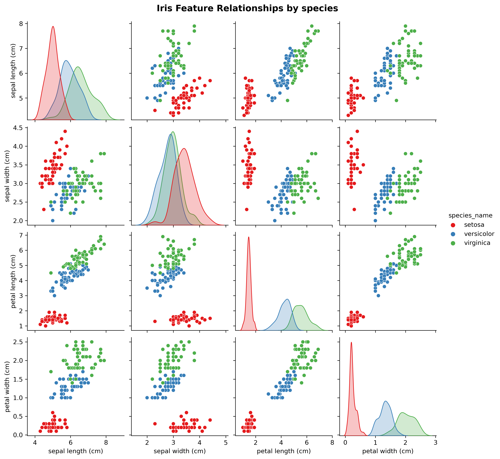
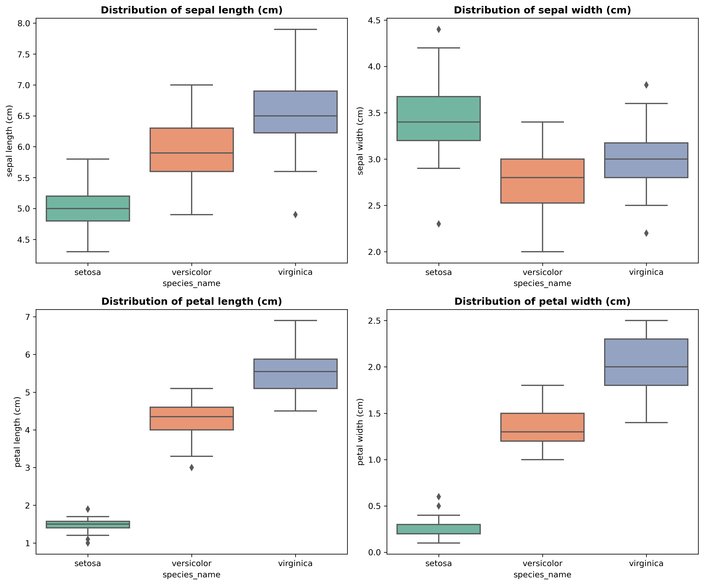
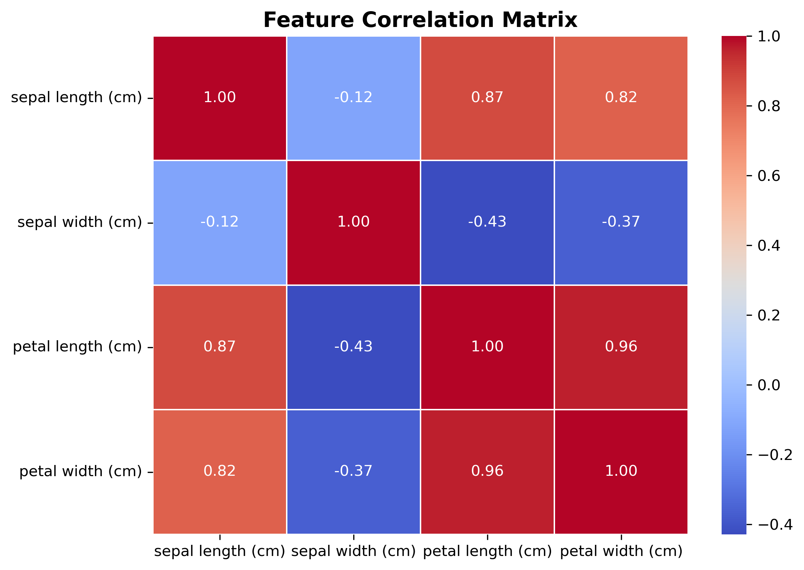
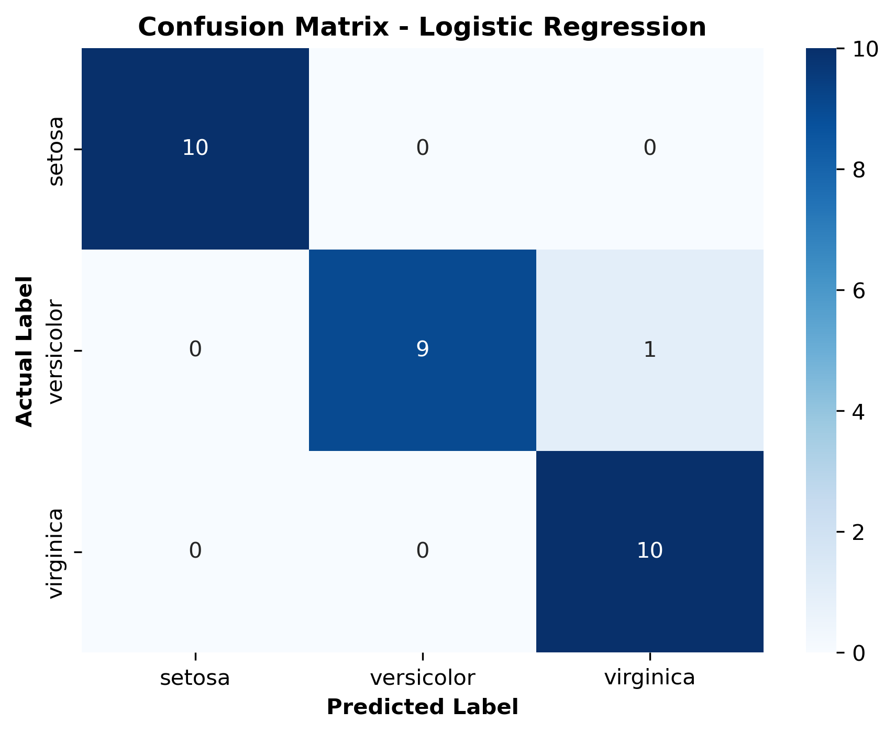

# OIBSIP
Data Science Internship Projects - Oasis Infobyte

# 🌸 Iris Flower Species Classification

An end-to-end Machine Learning project demonstrating data exploration, visual analysis, preprocessing, and classification using Logistic Regression on the classic Iris dataset.

---

## 📌 Project Overview

This project builds a supervised machine learning pipeline to classify Iris flower species into three categories (**Setosa**, **Versicolor**, and **Virginica**) based on sepal and petal dimensions. 

- **Accuracy Achieved:** `96.67%`
- **Model Used:** Logistic Regression
- **Data Split:** 80% Train / 20% Test (Stratified)

---

## 📊 Exploratory Data Analysis & Visualizations

### 1. Pairplot (Feature Relationships)
Shows pairwise scatter plots and kernel density estimates across species. Setosa is clearly linearly separable.



### 2. Boxplots (Distribution & Outliers)
Examines feature distributions and identifies minor outliers in sepal width.



### 3. Feature Correlation Heatmap
Highlights strong positive correlation between `petal length` and `petal width` ($r = 0.96$).



---

## ⚙️ Model Evaluation & Results

### Confusion Matrix
Demonstrates model predictions on the 30 test set samples (29 correct, 1 misclassification).



### Classification Metrics

| Species | Precision | Recall | F1-Score | Support |
| :--- | :---: | :---: | :---: | :---: |
| **Setosa** | 1.00 | 1.00 | 1.00 | 10 |
| **Versicolor** | 1.00 | 0.90 | 0.95 | 10 |
| **Virginica** | 0.91 | 1.00 | 0.95 | 10 |
| **Overall Accuracy** | — | — | **0.97** | **30** |

---

## 🛠️ Tech Stack & Dependencies

- **Python 3.9+**
- **Pandas** & **NumPy** (Data Manipulation)
- **Matplotlib** & **Seaborn** (Data Visualization)
- **Scikit-Learn** (Machine Learning Pipeline)

---

## 🚀 Quickstart Guide

1. **Clone the repository:**
   ```bash
   git clone [https://github.com/your-username/iris-classification-ml.git](https://github.com/your-username/iris-classification-ml.git)
   cd iris-classification-ml

## Streamlit App
Run locally with: `streamlit run app.py`